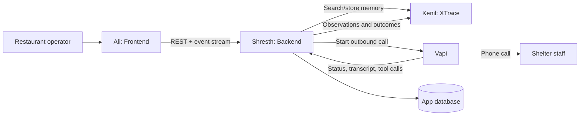

# XTrace Surplus Intelligence

XTrace Surplus Intelligence helps a restaurant sell food while it still has
commercial value and donate what remains before it becomes waste:

**surplus detected → timed deal to lapsed guests → unsold balance rolls into
donation recovery → XTrace improves the next call**

Recovery is the second half of the product, not the whole product. The deal
window protects revenue first; the donation path protects food and community
value after the deal expires or the sell allocation is exhausted.

## Product object: surplus event

One `surplus_event` owns both allocations so the same food cannot be sold and
donated twice.

```json
{
  "id": "se_123",
  "restaurantId": "rest_123",
  "food": {
    "description": "20 boxed chicken biryani meals",
    "initialQuantity": 20,
    "unit": "meal",
    "safeUntil": "2026-07-26T02:30:00Z"
  },
  "sell": {
    "allocatedQuantity": 12,
    "soldQuantity": 0,
    "originalPriceCents": 1499,
    "dealPriceCents": 999,
    "discountPercent": 33,
    "startsAt": "2026-07-25T23:30:00Z",
    "endsAt": "2026-07-26T00:15:00Z",
    "targetSegment": "lapsed_guests_30_90_days",
    "status": "live"
  },
  "donate": {
    "reservedQuantity": 8,
    "rolloverUnsoldDealQuantity": true,
    "releaseAt": "2026-07-26T00:15:00Z",
    "status": "scheduled"
  }
}
```

Invariant:
`available = initialQuantity - soldQuantity - acceptedDonationQuantity`.
When the deal countdown reaches zero, its unsold quantity moves to the donation
allocation atomically.

### Deal card shown to operators and guests

Every live deal card shows the food, remaining quantity, original and deal
price, discount, a real `endsAt` countdown, and the targeted lapsed-guest
segment. The operator sees sends, opens, claims, and remaining units. Guests see
one clear claim/reserve action. A deal is never an unbounded discount banner.

## Team ownership

| Owner | Area | Reads next |
|---|---|---|
| Kenil | XTrace memory, learned procedures, contested beliefs | [README_KENIL_XTRACE.md](./README_KENIL_XTRACE.md) |
| Ali | Frontend, screens, routes, API integration | [README_ALI_FRONTEND.md](./README_ALI_FRONTEND.md) |
| Shresth | Backend orchestration, database, Vapi calls and webhooks | [README_SHRESTH_BACKEND_VAPI.md](./README_SHRESTH_BACKEND_VAPI.md) |

## System architecture



### Connection rule

The frontend does not call Vapi or XTrace directly. It calls the backend. This keeps private keys off the browser and gives the backend one place to join call state, business data, and memory.

## Main demo flow

1. Inventory and demand intelligence create a surplus event.
2. The backend recommends a sell/donate split and a time-boxed price.
3. The frontend publishes a deal card to guests who have not visited in 30–90
   days, without training regular full-price buyers to wait for discounts.
4. Claims reduce the sell balance while the countdown runs.
5. At expiry, unsold deal units roll into the scheduled donation allocation.
6. The backend asks XTrace for useful shelter-call procedures and beliefs.
7. Vapi calls receivers; the backend records each outcome.
8. If a call fails, XTrace learns the blocker and the next call uses it.

The demo shows both halves: **a lapsed guest claims a timed deal, then the
remaining food enters recovery; call one fails, XTrace learns why, and call two
succeeds**.

## Shared data model

All IDs are strings. All timestamps are ISO 8601 UTC strings.

| Object | Purpose |
|---|---|
| `surplus_event` | Source of truth for one food batch and its sell/donate split |
| `deal` | A bounded sell allocation with price, audience, and countdown |
| `guest_segment` | Target audience; the default is lapsed guests, not active regulars |
| `recovery_case` | Donation allocation released from a surplus event |
| `receiver` | A shelter or other organization |
| `call` | One Vapi call attempt |
| `observation` | Something learned from a source |
| `procedure` | A reusable strategy for running a call |
| `belief` | A claim that may agree or conflict with other claims |

## Canonical API flow

### 1. Backend recommends the split and deal

`POST /api/v1/deals/recommend`

```json
{
  "inventoryCount": 20,
  "hoursToExpiry": 4,
  "demandLevel": "normal",
  "targetSegment": "lapsed_guests_30_90_days"
}
```

The response determines the discount and expected deal sales. The surplus-event
writer persists the resulting sell allocation and reserves the remaining units
for donation.

### 2. Frontend creates recovery for the released donation allocation

`POST /api/v1/recovery-cases`

```json
{
  "restaurantId": "rest_123",
  "food": {
    "description": "20 boxed chicken and rice meals",
    "quantity": 20,
    "unit": "meal",
    "allergens": ["dairy"],
    "preparedAt": "2026-07-25T18:30:00Z",
    "safeUntil": "2026-07-26T02:30:00Z",
    "temperatureF": 39
  },
  "pickup": {
    "address": "123 Market St, San Francisco, CA",
    "readyAt": "2026-07-26T01:00:00Z",
    "latestAt": "2026-07-26T02:00:00Z"
  }
}
```

Response:

```json
{
  "id": "rc_123",
  "status": "draft",
  "createdAt": "2026-07-25T23:10:00Z"
}
```

### 3. Frontend starts recovery

`POST /api/v1/recovery-cases/rc_123/start`

```json
{
  "receiverIds": ["recv_st_anthonys", "recv_harbor_house"],
  "mode": "sequential"
}
```

Response:

```json
{
  "recoveryCaseId": "rc_123",
  "status": "calling",
  "activeCallId": "call_123"
}
```

### 4. Backend requests XTrace guidance

`POST /xtrace/v1/guidance/search`

```json
{
  "task": "secure_food_donation_pickup",
  "receiver": {
    "id": "recv_st_anthonys",
    "name": "St. Anthony's",
    "type": "shelter",
    "isFirstContact": false
  },
  "food": {
    "allergens": ["dairy"],
    "preparedAt": "2026-07-25T18:30:00Z",
    "temperatureF": 39,
    "safeUntil": "2026-07-26T02:30:00Z"
  },
  "limit": 5
}
```

Response:

```json
{
  "procedures": [
    {
      "id": "proc_food_safety_first",
      "instruction": "Open with current temperature, preparation time, and safe-until time before asking about acceptance.",
      "confidence": 0.88,
      "scope": "shelter",
      "evidenceCount": 6
    }
  ],
  "beliefs": [
    {
      "id": "belief_kitchen_contact",
      "claim": "Ask for the kitchen directly after 5 PM.",
      "confidence": 0.77,
      "source": "call_091"
    }
  ]
}
```

### 4. Backend creates a Vapi call

The backend maps the case and XTrace guidance to Vapi. The exact external Vapi shape can stay inside the backend; this is the internal request used by our app:

```json
{
  "callId": "call_123",
  "receiver": {
    "id": "recv_st_anthonys",
    "name": "St. Anthony's",
    "phone": "+14155550100"
  },
  "openingContext": {
    "foodDescription": "20 boxed chicken and rice meals",
    "temperatureF": 39,
    "preparedAt": "2026-07-25T18:30:00Z",
    "safeUntil": "2026-07-26T02:30:00Z",
    "latestPickupAt": "2026-07-26T02:00:00Z"
  },
  "guidance": [
    "Open with current temperature, preparation time, and safe-until time.",
    "Ask for the kitchen directly after 5 PM."
  ],
  "callbackUrl": "https://api.example.com/api/v1/webhooks/vapi"
}
```

### 5. Vapi sends call results to backend

The backend must verify the webhook signature and immediately return `200`.

```json
{
  "eventId": "evt_vapi_123",
  "type": "call.ended",
  "call": {
    "id": "vapi_call_abc",
    "metadata": {
      "internalCallId": "call_123",
      "recoveryCaseId": "rc_123",
      "receiverId": "recv_st_anthonys"
    },
    "status": "ended",
    "endedReason": "customer-ended-call",
    "startedAt": "2026-07-25T23:12:00Z",
    "endedAt": "2026-07-25T23:14:03Z",
    "transcript": "..."
  }
}
```

### 6. Backend records the outcome in XTrace

`POST /xtrace/v1/episodes`

```json
{
  "idempotencyKey": "vapi:evt_vapi_123",
  "task": "secure_food_donation_pickup",
  "recoveryCaseId": "rc_123",
  "callId": "call_123",
  "receiverId": "recv_st_anthonys",
  "outcome": {
    "status": "accepted",
    "pickupConfirmed": true,
    "pickupWindow": {
      "start": "2026-07-26T01:15:00Z",
      "end": "2026-07-26T01:45:00Z"
    }
  },
  "observations": [
    {
      "statement": "The kitchen accepted after hearing the temperature and preparation time.",
      "sourceType": "call_transcript",
      "sourceId": "call_123",
      "observedAt": "2026-07-25T23:14:03Z"
    }
  ],
  "procedureFeedback": [
    {
      "procedureId": "proc_food_safety_first",
      "result": "helped"
    }
  ]
}
```

## Live frontend events

Use Server-Sent Events at `GET /api/v1/recovery-cases/:id/events`. WebSocket is also acceptable if already implemented.

```json
{
  "type": "call.updated",
  "recoveryCaseId": "rc_123",
  "call": {
    "id": "call_123",
    "receiverId": "recv_st_anthonys",
    "status": "accepted",
    "summary": "Pickup confirmed for 6:15–6:45 PM."
  },
  "occurredAt": "2026-07-25T23:14:04Z"
}
```

## Integration rules

- Use `camelCase` JSON keys.
- Never expose XTrace or Vapi secret keys to the frontend.
- Pass `recoveryCaseId`, `receiverId`, and `internalCallId` in Vapi metadata.
- Make webhook processing idempotent using `eventId`.
- Store raw Vapi events before transforming them.
- Store source and time for every XTrace observation.
- Do not overwrite conflicting claims; keep each claim with attribution.
- Return errors as:

```json
{
  "error": {
    "code": "RECEIVER_UNREACHABLE",
    "message": "The receiver did not answer.",
    "retryable": true,
    "requestId": "req_123"
  }
}
```

## Suggested repository layout

```text
/
├── README.md
├── README_KENIL_XTRACE.md
├── README_ALI_FRONTEND.md
├── README_SHRESTH_BACKEND_VAPI.md
├── frontend/
├── backend/
├── xtrace/
└── shared/
    └── contracts/
```

## Demo success checklist

- A user can create one surplus event with visible sell and donate quantities.
- A live deal card shows price, remaining units, lapsed-guest audience, and a
  real countdown.
- Claims reduce the sell balance; countdown expiry moves unsold units to donate.
- A user can start the resulting recovery case.
- The call timeline updates live.
- A failed call produces a visible learned blocker.
- The next call receives that guidance before it starts.
- An accepted call shows a confirmed pickup window.
- Conflicting reports remain visible with their sources.
