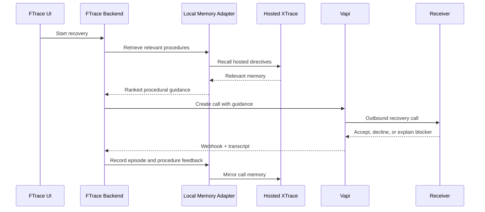
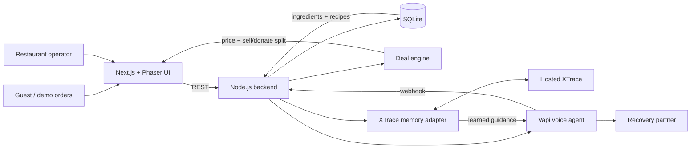

# FTrace

### Sell what still has value. Donate what does not. Learn every time.

FTrace is an AI-native surplus operating system for restaurants. It watches
inventory at the recipe level, predicts which prepared meals are at risk,
launches a time-boxed deal while the food still has commercial value, and sends
the remaining allocation into a voice-powered donation workflow before it
becomes waste.

The result is one continuous loop:

```text
order → ingredient inventory → surplus risk → intelligent deal
      → sell allocation → donate allocation → Vapi recovery call
      → XTrace memory → a better next decision
```

> **MenuSifu AI Hackathon — Track 2: How AI changes how restaurants operate**

FTrace is not only a restaurant dashboard. It demonstrates an operational model
in which pricing, inventory, recovery outreach, and organizational memory work
together automatically.

---

## Why FTrace?

Restaurant surplus has two kinds of value:

1. **Commercial value** while a meal can still be sold.
2. **Community value** when it should be recovered rather than discarded.

Most systems treat discounting and donation as unrelated workflows. That makes
staff notice waste too late, update inventory manually, and repeat the same
unsuccessful calls to recovery partners.

FTrace joins both halves:

- A customer order deducts the recipe's ingredients from SQLite.
- The deal engine immediately recalculates the restaurant's exposure.
- At-risk meals are split into **Sell Now** and **Donate Next**.
- The deal has a real price, target audience, and countdown.
- A restaurant operator can call a recovery partner through Vapi.
- XTrace supplies procedural memory before the call and records the outcome
  afterward.

## The live experience

The interface is a small playable restaurant city rather than a conventional
admin table. Each restaurant has a different menu, inventory profile, expiry
window, demand level, deal, and operational behavior.

### City view

Choose one of four restaurants:

| Restaurant | Demand profile | Demo behavior |
|---|---|---|
| Super Mario Broccoli | Low demand, high surplus risk | The first order triggers recovery outreach |
| Pixel Noodle Bar | Normal demand, short expiry | Includes a multi-order demo preset |
| Block Burger Co | High demand, low surplus risk | Often keeps more inventory at normal price |
| Voxel Taco Stand | Low demand, one hour to expiry | Urgent deal-and-recovery allocation |

### Restaurant view

Each restaurant page shows:

- dollars of surplus saved;
- meals rescued;
- the current dish and discount;
- a live deal formula with the restaurant's current numbers;
- the original and discounted price;
- Sell Now and Donate Next quantities;
- a countdown and allocation bar;
- real and simulated menu ordering;
- a live event log;
- an operator-facing recovery call button.

When somebody orders, the UI does not merely animate a fake counter. It calls
the backend, writes the order, deducts every recipe ingredient, fetches the new
inventory, and requests a fresh deal recommendation.

## Deal and donation algorithm

FTrace uses a deterministic, explainable baseline so an operator can understand
why a price or donation quantity changed.

Let:

- `I` = meals currently in inventory
- `H` = hours until expiry
- `R` = expected hourly sales rate
- `D` = discount as a decimal

Demand maps to an hourly rate:

| Demand | Expected sales/hour |
|---|---:|
| Low | 0.8 |
| Normal | 2 |
| High | 4 |

The engine calculates:

```text
expected normal sales = min(I, round(R × H))
at risk               = max(0, I − expected normal sales)
deal price            = original price × (1 − discount)
expected deal sales   = min(at risk, round(at risk × min(0.9, discount / 45)))
donate quantity       = max(0, I − normal sales − deal sales)
sell quantity         = I − donate quantity
```

The base discount is:

| Condition | Base discount |
|---|---:|
| At risk ≤ 2 | 0% |
| More than 4 hours remain | 20% |
| 2–4 hours remain | 30% |
| 2 hours or less remain | 40% |
| Low demand | +10 percentage points |

XTrace memory can then adjust the policy:

- a similar 30% deal selling out creates a 30% floor;
- a previous kitchen overload caps the deal at 25%;
- historically weak rainy-day walk-ins add 10 points, capped at 50%.

If one hour or less remains and recovery inventory exists, the action becomes
`deal_and_recovery`. The formula card on every restaurant page displays the
live inputs and result rather than hiding the decision in a black box.

## Recipe-aware inventory

Recipes connect menu orders to raw inventory. Ordering ten biryanis, for
example, creates one order transaction and deducts all related ingredients:

```text
10 biryanis
  ├─ basmati rice
  ├─ chicken
  ├─ onion
  └─ yogurt
```

The database transaction validates every ingredient first. If any ingredient
would fall below zero, the order is rejected and no partial deductions are
written.

## Voice recovery with Vapi

Vapi is the action layer for donation recovery.

The call button:

1. creates a recovery case containing the restaurant, food-safety facts, and
   pickup window;
2. asks XTrace for relevant call procedures;
3. builds a natural-language prompt with those procedures;
4. starts an outbound Vapi call to the selected receiver;
5. polls and displays call progress;
6. receives the final webhook;
7. stores the outcome and advances to the next receiver when needed.

The assistant is configured to speak slowly, pronounce dates and times
naturally, avoid reading ISO timestamps or UUIDs aloud, and tolerate a noisy
environment.

No Vapi or XTrace secret is ever sent to the browser.

## What XTrace actually does

XTrace is connected inside the recovery workflow—not used as a decorative
health badge.



FTrace currently demonstrates three useful memory forms:

- **Procedural memory:** reusable instructions such as leading with food
  temperature and safe-until time.
- **Semantic memory:** facts extracted from outcomes, such as a shelter's intake
  constraints.
- **Episodic memory:** the history of a specific recovery attempt, transcript,
  result, and learned blocker.

The local adapter makes the demo deterministic and testable. When
`XTRACE_API_KEY` is present, it also recalls from and writes to hosted XTrace.
If hosted XTrace is unavailable, local memory keeps the core demo operational.

## Architecture



### Stack

| Layer | Technology |
|---|---|
| Experience | Next.js 15, React, Phaser, Zustand, GSAP, Tailwind CSS |
| API | Node.js HTTP server |
| Persistence | SQLite |
| Voice agent | Vapi |
| Memory | XTrace hosted API plus deterministic local adapter |
| Public webhook tunnel | ngrok |
| Testing | Node test runner and Next.js production build |

## Run locally

### Requirements

- Node.js 22.5 or newer
- npm
- ngrok for public Vapi webhooks
- Vapi credentials for live calls
- XTrace credentials for hosted memory

### 1. Install dependencies

```bash
npm install
npm --prefix frontend install
npm --prefix xtrace install
```

### 2. Configure the environment

```bash
cp .env.example .env
cp frontend/.env.example frontend/.env.local
cp xtrace/.env.example xtrace/.env
```

Fill in the private values locally:

```dotenv
VAPI_API_KEY=
VAPI_PHONE_NUMBER_ID=
VAPI_ASSISTANT_ID=
VAPI_TEST_DESTINATION=
VAPI_WEBHOOK_TOKEN=
PUBLIC_BASE_URL=

XTRACE_API_KEY=
XTRACE_SERVICE_URL=http://localhost:7070
XTRACE_SERVICE_TOKEN=dev-token
```

All real `.env` files are ignored by Git. Never commit or expose these keys in
frontend code.

### 3. Seed SQLite

```bash
npm run seed
```

### 4. Start the complete local stack

```bash
npm run start:stack
```

This starts:

| Service | URL |
|---|---|
| Frontend | `http://localhost:3000` |
| Backend | `http://localhost:8000` |
| XTrace memory adapter | `http://localhost:7070` |

For a public Vapi webhook URL:

```bash
ngrok http 8000
```

Set `PUBLIC_BASE_URL` to the HTTPS ngrok origin and configure the Vapi webhook
as:

```text
https://YOUR-NGROK-DOMAIN/api/v1/webhooks/vapi
```

### 5. Verify the stack

```bash
npm run test:all
```

This runs the backend tests, XTrace tests, and an optimized frontend build.

Useful health checks:

```bash
curl http://localhost:8000/health
curl http://localhost:7070/health
curl http://localhost:8000/api/v1/memory/health
```

## Demo script

For a concise judge demo:

1. Open the city and enter **Pixel Noodle Bar**.
2. Point out that the deal, formula, KPIs, and allocation are specific to that
   restaurant.
3. Open **Demo Orders**, submit the preset, and watch recipe ingredients,
   inventory exposure, pricing, and the allocation bar recalculate.
4. Return to the city and enter **Super Mario Broccoli**.
5. Place one order to demonstrate the restaurant-specific automatic recovery
   trigger.
6. Use the header **Call** button to launch the recovery workflow.
7. Show the live call status and recovery event log.
8. Explain that XTrace guidance is retrieved before the call and the outcome is
   stored afterward, improving the next attempt.

## API overview

| Method | Route | Purpose |
|---|---|---|
| `GET` | `/health` | Backend, database, Vapi, and XTrace configuration |
| `GET` | `/api/v1/ingredients` | Current ingredient inventory |
| `PATCH` | `/api/v1/ingredients/:id` | Update ingredient stock |
| `GET` | `/api/v1/recipes` | Recipes and ingredient requirements |
| `POST` | `/api/v1/orders` | Place an order and deduct its recipe |
| `GET` | `/api/v1/orders` | Order history |
| `POST` | `/api/v1/deals/recommend` | Calculate price and sell/donate split |
| `GET/POST` | `/api/v1/receivers` | Manage recovery partners |
| `GET/POST` | `/api/v1/recovery-cases` | Inspect or create recovery cases |
| `POST` | `/api/v1/recovery-cases/:id/start` | Start sequential Vapi outreach |
| `GET` | `/api/v1/recovery-cases/:id/conflicts` | Retrieve contested memory |
| `GET` | `/api/v1/memory/procedures` | Inspect learned procedures |
| `POST` | `/api/v1/vapi/test-call` | Launch an explicit test call |
| `POST` | `/api/v1/webhooks/vapi` | Receive authenticated Vapi events |

Errors use a consistent response:

```json
{
  "error": {
    "code": "INVALID_DEAL_INPUT",
    "message": "A human-readable explanation.",
    "retryable": false,
    "requestId": "req_..."
  }
}
```

## Repository map

```text
FTrace/
├── frontend/                      # Next.js, Phaser, Zustand UI
├── backend/
│   ├── src/                       # API and domain services
│   └── test/                      # Backend unit/integration tests
├── xtrace/
│   ├── src/                       # Memory, episodes, beliefs, guidance
│   └── test/                      # Memory service tests
├── shared/contracts/              # Team integration contracts
├── scripts/                       # Stack startup and memory reset
├── README_ALI_FRONTEND.md         # Frontend handoff
├── README_SHRESTH_BACKEND_VAPI.md # Backend and Vapi handoff
└── README_KENIL_XTRACE.md         # XTrace handoff
```

## What is real, and what remains

### Implemented

- Distinct restaurant profiles and menus
- Real SQLite inventory and recipe hydration
- Transactional ingredient deduction per order
- Live deal recalculation
- Explainable discount and donation formulas
- Restaurant-specific demo and automatic call behavior
- Recovery case persistence and sequential receiver orchestration
- Real Vapi outbound-call integration and webhook processing
- Local procedural, semantic, and episodic memory
- Hosted XTrace recall and transcript mirroring when configured
- Responsive status, logs, call progress, and error handling

### Production hardening still needed

- Authentication and restaurant-level tenant isolation
- A durable background queue for calls and webhook retries
- Signed Vapi webhook verification beyond the current shared token
- Real POS and demand-forecast integrations
- Database migrations and a production database
- Compliance review, receiver consent, and monitored escalation
- A fully atomic persisted surplus-event lifecycle across deal expiry
- Broader evaluation of learned memories before autonomous policy changes

We state these boundaries intentionally: the hackathon system is a working
end-to-end prototype, while these items are the path to production.

## Team

| Owner | Area | Detailed handoff |
|---|---|---|
| Ali | Frontend and interactive experience | [Frontend README](./README_ALI_FRONTEND.md) |
| Shresth | Backend, SQLite, Vapi, orchestration | [Backend + Vapi README](./README_SHRESTH_BACKEND_VAPI.md) |
| Kenil | XTrace memory and learning | [XTrace README](./README_KENIL_XTRACE.md) |

---

<p align="center">
  <strong>FTrace turns surplus from a last-minute disposal problem into a continuously learned operating decision.</strong>
</p>
