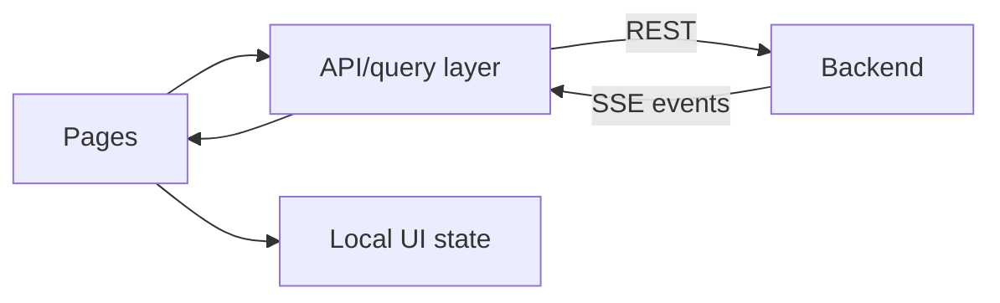

# Ali — Frontend

Your job is to make the learning loop obvious in under one minute. The key screen is not a large analytics dashboard. It is a recovery case timeline that shows:

**surplus found → call failed → blocker learned → next call used the lesson → pickup confirmed**

## What Ali owns

- Frontend app in `/frontend`
- Routes and page components
- Forms and client-side validation
- Backend API client
- Live call timeline using Server-Sent Events
- Clear loading, empty, error, and retry states

Ali does not call XTrace or Vapi directly and must not place their keys in browser environment variables.

## Recommended routes

| Route | Screen |
|---|---|
| `/` | Recovery cases and “New recovery” button |
| `/recovery/new` | Food, safety, pickup, and receiver form |
| `/recovery/:caseId` | Live recovery timeline and call controls |
| `/recovery/:caseId/memory` | Procedures learned and contested beliefs |
| `/receivers` | Receiver list and contact status |
| `/receivers/:receiverId` | Receiver details and prior calls |

If time is short, build only `/`, `/recovery/new`, and `/recovery/:caseId`.

## Frontend architecture



Use the backend as the source of truth. Optimistic UI is fine for form submission, but call status should come from backend events.

## Environment

```text
NEXT_PUBLIC_API_BASE_URL=http://localhost:8000
```

Only `NEXT_PUBLIC_*` values are visible in the browser. Never add Vapi or XTrace secret keys there.

## API calls

### List cases

`GET /api/v1/recovery-cases`

```json
{
  "items": [
    {
      "id": "rc_123",
      "status": "calling",
      "foodDescription": "20 boxed chicken and rice meals",
      "acceptedReceiverName": null,
      "createdAt": "2026-07-25T23:10:00Z"
    }
  ]
}
```

### Create a case

`POST /api/v1/recovery-cases`

```json
{
  "restaurantId": "rest_123",
  "food": {
    "description": "20 boxed chicken and rice meals",
    "quantity": 20,
    "unit": "meal",
    "allergens": ["dairy"],
    "preparedAt": "2026-07-25T18:30:00Z",
    "safeUntil": "2026-07-26T02:30:00Z",
    "temperatureF": 39
  },
  "pickup": {
    "address": "123 Market St, San Francisco, CA",
    "readyAt": "2026-07-26T01:00:00Z",
    "latestAt": "2026-07-26T02:00:00Z"
  }
}
```

On success, route to `/recovery/rc_123`.

### Get full case state

`GET /api/v1/recovery-cases/rc_123`

```json
{
  "id": "rc_123",
  "status": "calling",
  "food": {
    "description": "20 boxed chicken and rice meals",
    "quantity": 20,
    "unit": "meal",
    "allergens": ["dairy"],
    "temperatureF": 39
  },
  "calls": [
    {
      "id": "call_122",
      "receiver": {
        "id": "recv_1",
        "name": "St. Anthony's"
      },
      "status": "rejected",
      "summary": "Asked for preparation time before accepting.",
      "startedAt": "2026-07-25T23:02:00Z",
      "endedAt": "2026-07-25T23:03:10Z"
    },
    {
      "id": "call_123",
      "receiver": {
        "id": "recv_2",
        "name": "Harbor House"
      },
      "status": "in_progress",
      "summary": null,
      "startedAt": "2026-07-25T23:12:00Z",
      "endedAt": null
    }
  ],
  "memory": {
    "appliedProcedures": [
      {
        "id": "proc_food_safety_first",
        "instruction": "Lead with temperature and preparation time.",
        "learnedFromCallId": "call_122"
      }
    ],
    "conflictCount": 0
  }
}
```

### Start calling

`POST /api/v1/recovery-cases/rc_123/start`

```json
{
  "receiverIds": ["recv_1", "recv_2"],
  "mode": "sequential"
}
```

Disable the start button while this request is pending. Treat a repeated click as safe, but do not intentionally send duplicates.

## Live event stream

Open:

```text
GET /api/v1/recovery-cases/rc_123/events
```

Handle these event types:

```json
{
  "type": "call.started",
  "recoveryCaseId": "rc_123",
  "call": {
    "id": "call_123",
    "receiverId": "recv_2",
    "receiverName": "Harbor House",
    "status": "in_progress"
  },
  "occurredAt": "2026-07-25T23:12:00Z"
}
```

```json
{
  "type": "memory.learned",
  "recoveryCaseId": "rc_123",
  "memory": {
    "kind": "procedure",
    "id": "proc_food_safety_first",
    "instruction": "Lead with temperature and preparation time.",
    "learnedFromCallId": "call_122"
  },
  "occurredAt": "2026-07-25T23:04:00Z"
}
```

```json
{
  "type": "call.updated",
  "recoveryCaseId": "rc_123",
  "call": {
    "id": "call_123",
    "receiverId": "recv_2",
    "status": "accepted",
    "summary": "Pickup confirmed for 6:15–6:45 PM."
  },
  "occurredAt": "2026-07-25T23:14:04Z"
}
```

On any unknown event type, ignore it rather than crashing. Re-fetch the case when the stream reconnects.

## Recovery timeline UI

Each call card should show:

- Receiver name and status
- Call duration
- One-sentence result
- Guidance used before the call
- New lesson created after the call

Highlight the transfer explicitly:

> Learned from St. Anthony's → used on first call to Harbor House

For contested beliefs, show separate source cards:

```text
Kitchen · 9:35 PM
“Food was bagged and ready at 9:30.”

Driver · 9:47 PM
“The back door was locked at 9:45.”

Shelter · 10:02 PM
“Nobody came.”
```

Do not label one as “the truth.” Show the backend/XTrace recommended next action below them.

## Status values and labels

| API status | UI label |
|---|---|
| `draft` | Ready to start |
| `searching` | Finding receivers |
| `queued` | Call queued |
| `ringing` | Calling |
| `in_progress` | On the phone |
| `rejected` | Not accepted |
| `no_answer` | No answer |
| `accepted` | Pickup confirmed |
| `failed` | Call failed |
| `cancelled` | Cancelled |

## Error contract

```json
{
  "error": {
    "code": "RECEIVER_UNREACHABLE",
    "message": "The receiver did not answer.",
    "retryable": true,
    "requestId": "req_123"
  }
}
```

Show `message` to the user. Show a retry button only when `retryable` is true. Log `requestId` for debugging.

## Build order

1. Create the three minimum routes.
2. Use mocked backend JSON to complete the timeline.
3. Connect create/get/start endpoints.
4. Connect the event stream.
5. Add the memory transfer animation or highlight.
6. Add contested-belief cards if time remains.

## Done when

- No secret keys ship to the browser.
- A user can create and start a recovery case.
- Refreshing the page restores current state.
- New call and memory events appear without refreshing.
- The learning transfer is visible in one glance.
- Loading, empty, error, disconnected, and completed states all render.

