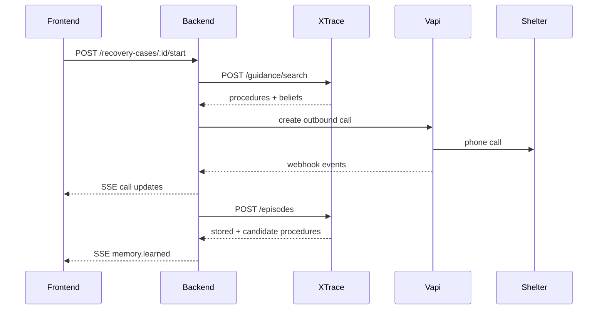

# Shresth — Backend and Vapi

Your job is to orchestrate the whole recovery. The backend owns business state, asks XTrace what the agent should remember, starts Vapi calls, processes Vapi events, and streams updates to Ali's frontend.

## Current implementation

The backend is implemented in `/backend` using Node 22's built-in HTTP server,
SQLite, and test runner. No package installation is required.

```bash
npm test
npm run seed
npm start
```

Default local URL: `http://localhost:8000`

Implemented inventory routes:

| Method | Path | Purpose |
|---|---|---|
| `GET` | `/api/v1/ingredients` | Current ingredient stock |
| `PATCH` | `/api/v1/ingredients/:ingredientId` | Set stock quantity |
| `GET` | `/api/v1/recipes` | Recipes and per-serving ingredients |
| `POST` | `/api/v1/orders` | Create order and deduct ingredients atomically |
| `GET` | `/api/v1/orders` | Order history |
| `POST` | `/api/v1/deals/recommend` | Inventory-based deal decision |
| `POST` | `/api/v1/vapi/test-call` | Place configured test call |
| `POST` | `/api/v1/webhooks/vapi` | Receive Vapi events |
| `POST` | `/api/v1/receivers` | Add a shelter or receiver |
| `GET` | `/api/v1/receivers` | List active receivers |
| `POST` | `/api/v1/recovery-cases/:id/start` | Begin sequential calls |

Seeded Chicken Biryani requirements per serving:

| Ingredient | Quantity |
|---|---:|
| Basmati rice | 0.20 kg |
| Chicken | 0.25 kg |
| Onion | 0.05 kg |
| Yogurt | 0.04 kg |

Therefore, an order for 10 biryanis deducts 2 kg rice, 2.5 kg chicken,
0.5 kg onion, and 0.4 kg yogurt in one transaction.

```bash
curl -X POST http://localhost:8000/api/v1/orders \
  -H 'Content-Type: application/json' \
  -d '{"recipeId":"recipe_biryani","quantity":10}'
```

If any ingredient is short, the API returns `409 INSUFFICIENT_INVENTORY` and
deducts nothing.

### Provision the saved Vapi assistant

```bash
node backend/src/vapi-assistant-setup-cli.js
```

The command creates or updates one assistant named `XTrace Surplus Recovery`.
Put the returned ID in `VAPI_ASSISTANT_ID`.

If the backend has a public HTTPS URL, set it before running the command:

```text
PUBLIC_BASE_URL=https://your-backend.example.com
```

The assistant will then send `status-update` and `end-of-call-report` messages
to:

```text
https://your-backend.example.com/api/v1/webhooks/vapi
```

### End-to-end recovery example

Create two receivers:

```bash
curl -X POST http://localhost:8000/api/v1/receivers \
  -H 'Content-Type: application/json' \
  -d '{"name":"First Shelter","type":"shelter","phone":"+14085550111"}'
```

Create a recovery case:

```bash
curl -X POST http://localhost:8000/api/v1/recovery-cases \
  -H 'Content-Type: application/json' \
  -d '{
    "restaurantId":"rest_123",
    "restaurantName":"Demo Kitchen",
    "food":{
      "description":"Chicken biryani",
      "quantity":10,
      "unit":"meals",
      "allergens":["dairy"],
      "preparedAt":"2026-07-25T18:30:00Z",
      "safeUntil":"2026-07-26T02:30:00Z",
      "temperatureF":39
    },
    "pickup":{
      "address":"123 Market St",
      "readyAt":"2026-07-26T01:00:00Z",
      "latestAt":"2026-07-26T02:00:00Z"
    }
  }'
```

Start calls in priority order:

```bash
curl -X POST http://localhost:8000/api/v1/recovery-cases/CASE_ID/start \
  -H 'Content-Type: application/json' \
  -d '{"receiverIds":["FIRST_RECEIVER_ID","SECOND_RECEIVER_ID"]}'
```

The backend calls only one receiver at a time. A rejected
`end-of-call-report` starts the next receiver. A confirmed acceptance changes
the case to `accepted` and stops the sequence. XTrace is not required for this
workflow; its future guidance can be added before `createOutboundCall`.

## What Shresth owns

- Backend service in `/backend`
- Main application database
- Public REST API used by the frontend
- Server-Sent Events stream
- Receiver ordering and sequential call orchestration
- Vapi assistant configuration and outbound calls
- Vapi webhook verification and normalization
- XTrace client integration

Shresth does not implement XTrace's internal ranking or the frontend screens.

## Service connections



## Environment

```text
PORT=8000
DATABASE_URL=postgresql://...
FRONTEND_ORIGIN=http://localhost:3000

VAPI_API_KEY=...
VAPI_PHONE_NUMBER_ID=...
VAPI_ASSISTANT_ID=...
VAPI_WEBHOOK_SECRET=...

XTRACE_BASE_URL=http://localhost:8100
XTRACE_SERVICE_TOKEN=...
PUBLIC_BASE_URL=https://your-tunnel.example.com
```

Only the backend reads these values. Commit an `.env.example`, never `.env`.

## Backend API for Ali

### Recovery cases

| Method | Path | Purpose |
|---|---|---|
| `POST` | `/api/v1/recovery-cases` | Create a case |
| `GET` | `/api/v1/recovery-cases` | List cases |
| `GET` | `/api/v1/recovery-cases/:id` | Return full case state |
| `POST` | `/api/v1/recovery-cases/:id/start` | Start sequential calls |
| `POST` | `/api/v1/recovery-cases/:id/cancel` | Stop future calls |
| `GET` | `/api/v1/recovery-cases/:id/events` | SSE updates |

### Receivers

| Method | Path | Purpose |
|---|---|---|
| `GET` | `/api/v1/receivers` | List available receivers |
| `POST` | `/api/v1/receivers` | Add a receiver |
| `GET` | `/api/v1/receivers/:id` | Receiver and call history |

Canonical create request:

```json
{
  "restaurantId": "rest_123",
  "food": {
    "description": "20 boxed chicken and rice meals",
    "quantity": 20,
    "unit": "meal",
    "allergens": ["dairy"],
    "preparedAt": "2026-07-25T18:30:00Z",
    "safeUntil": "2026-07-26T02:30:00Z",
    "temperatureF": 39
  },
  "pickup": {
    "address": "123 Market St, San Francisco, CA",
    "readyAt": "2026-07-26T01:00:00Z",
    "latestAt": "2026-07-26T02:00:00Z"
  }
}
```

Validate that `preparedAt < readyAt <= latestAt <= safeUntil`.

## Database records

Minimum tables:

```text
recovery_cases
  id, restaurant_id, status, food_json, pickup_json, created_at, updated_at

receivers
  id, name, type, phone_e164, address_json, active, created_at

calls
  id, recovery_case_id, receiver_id, vapi_call_id, status,
  guidance_json, summary, started_at, ended_at

webhook_events
  provider, event_id, payload_json, received_at, processed_at

case_events
  id, recovery_case_id, type, payload_json, occurred_at
```

XTrace owns procedures, observations, beliefs, and their evidence. The app database may cache their IDs and display summaries but should not become a second memory source of truth.

## Call orchestration state machine

```text
draft
  → calling
      → accepted
      → exhausted
      → cancelled
      → failed
```

Individual call:

```text
queued → ringing → in_progress → accepted
                              ↘ rejected
                              ↘ no_answer
                              ↘ failed
```

Only one receiver should be called at a time in `sequential` mode. Start the next receiver only when the previous call has a terminal non-accepted status.

## XTrace request before each call

`POST ${XTRACE_BASE_URL}/xtrace/v1/guidance/search`

```json
{
  "task": "secure_food_donation_pickup",
  "receiver": {
    "id": "recv_456",
    "name": "Harbor House",
    "type": "shelter",
    "isFirstContact": true
  },
  "food": {
    "allergens": ["dairy"],
    "preparedAt": "2026-07-25T18:30:00Z",
    "temperatureF": 39,
    "safeUntil": "2026-07-26T02:30:00Z"
  },
  "limit": 5
}
```

Store the returned guidance snapshot on the `calls` row. This proves exactly what memory influenced the call.

## Internal Vapi call input

Create a function such as `startReceiverCall(input)` with:

```json
{
  "internalCallId": "call_123",
  "recoveryCaseId": "rc_123",
  "receiver": {
    "id": "recv_456",
    "name": "Harbor House",
    "phone": "+14155550100"
  },
  "food": {
    "description": "20 boxed chicken and rice meals",
    "quantity": 20,
    "unit": "meal",
    "allergens": ["dairy"],
    "preparedAt": "2026-07-25T18:30:00Z",
    "safeUntil": "2026-07-26T02:30:00Z",
    "temperatureF": 39
  },
  "pickup": {
    "address": "123 Market St, San Francisco, CA",
    "readyAt": "2026-07-26T01:00:00Z",
    "latestAt": "2026-07-26T02:00:00Z"
  },
  "guidance": [
    {
      "id": "proc_food_safety_first",
      "instruction": "Lead with current temperature, preparation time, and safe-until time."
    }
  ]
}
```

Map this to the current Vapi API/SDK on the server. Always include:

```json
{
  "metadata": {
    "internalCallId": "call_123",
    "recoveryCaseId": "rc_123",
    "receiverId": "recv_456"
  }
}
```

Metadata is how webhooks reconnect an external Vapi call to internal state.

## Voice agent behavior

The system prompt should tell the agent to:

- Say it is calling for the named restaurant.
- Give the food description, quantity, allergens, temperature, preparation time, and safe-until time.
- Apply XTrace guidance naturally, not read it as a list.
- Ask whether the receiver can accept the food tonight.
- Confirm pickup address, entrance, contact, and time window.
- Never invent food-safety information.
- If the receiver cannot decide, ask who can and how to reach them.
- End with a short verbal confirmation.

The structured result needed from the call:

```json
{
  "status": "accepted",
  "reason": null,
  "pickupConfirmed": true,
  "pickup": {
    "start": "2026-07-26T01:15:00Z",
    "end": "2026-07-26T01:45:00Z",
    "address": "100 Jones St, San Francisco, CA",
    "entrance": "Back kitchen door",
    "contactName": "Maria",
    "contactPhone": "+14155550199"
  },
  "blockers": [],
  "newObservations": [
    "Ask for the kitchen directly after 5 PM."
  ],
  "summary": "Maria confirmed pickup at the back kitchen door from 6:15–6:45 PM."
}
```

For a failed attempt:

```json
{
  "status": "rejected",
  "reason": "food_safety_information_missing",
  "pickupConfirmed": false,
  "pickup": null,
  "blockers": [
    "Receiver needed the time the meals came off the line."
  ],
  "newObservations": [
    "Preparation time is required before this receiver can decide."
  ],
  "summary": "Receiver could not accept without the preparation time."
}
```

## Vapi webhook

Endpoint:

```text
POST /api/v1/webhooks/vapi
```

Representative normalized event:

```json
{
  "eventId": "evt_vapi_123",
  "type": "call.ended",
  "call": {
    "id": "vapi_call_abc",
    "metadata": {
      "internalCallId": "call_123",
      "recoveryCaseId": "rc_123",
      "receiverId": "recv_456"
    },
    "status": "ended",
    "endedReason": "customer-ended-call",
    "startedAt": "2026-07-25T23:12:00Z",
    "endedAt": "2026-07-25T23:14:03Z",
    "transcript": "...",
    "structuredResult": {
      "status": "accepted",
      "pickupConfirmed": true,
      "summary": "Pickup confirmed for 6:15–6:45 PM."
    }
  }
}
```

Vapi's raw payload can vary with SDK/API version. Keep a provider adapter:

```text
raw Vapi event → verify → store raw → normalize → update call → XTrace episode → SSE
```

Webhook requirements:

1. Verify the signature using `VAPI_WEBHOOK_SECRET`.
2. Insert the raw event using unique key `(provider, event_id)`.
3. Return `200` for an already-seen event.
4. Return `200` quickly and process slow work asynchronously when possible.
5. Never start the next call twice.

## Send the episode to Kenil

After a terminal call:

```json
{
  "idempotencyKey": "vapi:evt_vapi_123",
  "task": "secure_food_donation_pickup",
  "recoveryCaseId": "rc_123",
  "callId": "call_123",
  "receiverId": "recv_456",
  "guidanceSearchId": "search_123",
  "outcome": {
    "status": "accepted",
    "pickupConfirmed": true,
    "pickupWindow": {
      "start": "2026-07-26T01:15:00Z",
      "end": "2026-07-26T01:45:00Z"
    }
  },
  "observations": [
    {
      "statement": "The receiver accepted after hearing the temperature and preparation time.",
      "sourceType": "call_transcript",
      "sourceId": "call_123",
      "speaker": "receiver",
      "observedAt": "2026-07-25T23:14:03Z"
    }
  ],
  "procedureFeedback": [
    {
      "procedureId": "proc_food_safety_first",
      "result": "helped"
    }
  ]
}
```

If XTrace is temporarily down, persist an outbox job and retry. Do not lose the call result or block the frontend.

## Events sent to Ali

Store each event in `case_events`, then publish it over SSE:

```json
{
  "type": "memory.learned",
  "recoveryCaseId": "rc_123",
  "memory": {
    "kind": "procedure",
    "id": "proc_food_safety_first",
    "instruction": "Lead with temperature and preparation time.",
    "learnedFromCallId": "call_122"
  },
  "occurredAt": "2026-07-25T23:04:00Z"
}
```

Support SSE reconnection with an event ID and `Last-Event-ID` if time allows. At minimum, the frontend can re-fetch full case state after reconnecting.

## Error response

All frontend-facing errors use:

```json
{
  "error": {
    "code": "RECEIVER_UNREACHABLE",
    "message": "The receiver did not answer.",
    "retryable": true,
    "requestId": "req_123"
  }
}
```

Log `requestId` with the underlying exception. Do not return provider keys, raw stack traces, or full sensitive transcripts in an error.

## Build order

1. Create case/receiver/call tables and REST endpoints.
2. Mock `guidance/search`, then store the returned snapshot per call.
3. Start one Vapi outbound call with metadata.
4. Verify and store webhook events.
5. Normalize call outcome and update the database.
6. Send SSE events to the frontend.
7. Post the completed episode to XTrace.
8. Add sequential retry with the next receiver.

## Done when

- Duplicate start requests do not create duplicate calls.
- Duplicate Vapi events are harmless.
- A call can always be traced by internal ID, Vapi ID, case ID, and receiver ID.
- Guidance used is stored before the call begins.
- Every terminal call creates one XTrace episode.
- XTrace downtime does not lose the episode.
- Ali receives call and memory updates in the documented shape.
